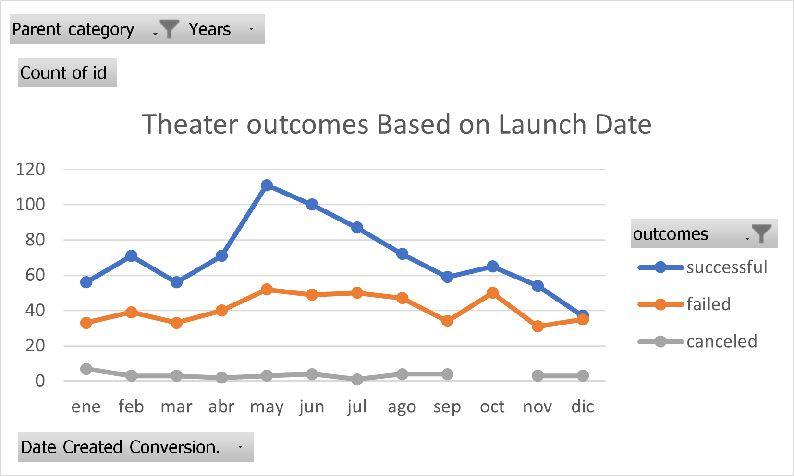
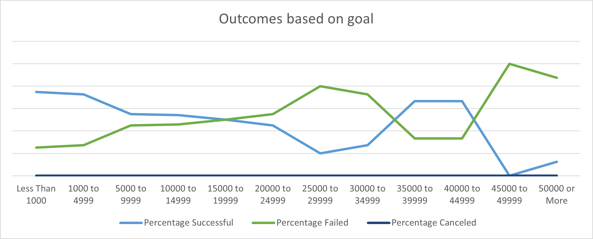

# kickstarter_anaylsis_homework

# Kickstarting with Excel

## Overview of Project

### Purpose

The purpose of the project was to analyze and understand how different campaigns with different launch dates and funding goals get different outcomes to get insights as to how companies interested specifically in plays should use plan strategies to become successful learning from other campaigns outcomes.

## Analysis and Challenges

The analysis done went from a macro perspective to micro. First, the idea was to understand the outcome from different theatre campaigns in comparison to the launch month. Please see graph below: 

Afterwards, we apply one more layer of specificity by focusing on the outcome of plays regarding the goal that was planned. Please see graph below:

Some of the challenges that could happen while doing the analysis are:
  1.	Losing visibility on the business question that needs to be answered. And, therefore doing mechanic work instead of work that implies thinking about strategies and/or a business outcome or decision making
  2.	The conversion of date to a format that could be understood as such would had been challenging if I wasn´t explained about the conversion formula; this is something new I learnt and found very interesting.
  3.	Thinking about the technical side, I would say that using the “$” signs in formulas could be something challenging for people to understand when grasping the concept for the first time.

### Analysis of Outcomes Based on Launch Date
Please check the "Results" section for this information

### Analysis of Outcomes Based on Goals
Please check the "Results" section for this information

### Challenges and Difficulties Encountered
Please check the "Results" section for this information

## Results

- What are two conclusions you can draw about the Outcomes based on Launch Date?

    1. We can see that the best month to launch theater campaigns is May. The second best is June
    2. The worst month is by far December by having a very similar number of plays that were successful vs the ones that failed.

- What can you conclude about the Outcomes based on Goals?

It seems that the plays that have a goal lower than 1000 are the most successful. The second most successful are the plays that have a goal between 1000 and 4999.

- What are some limitations of this dataset?

Some of the limitations encountered in the dataset are: there are some ranks on goals used for the “ Outcomes based on Goals” graph that have few observations; therefore we don´t have a big enough sample size that let us be confident on the conclusions made. I would also add that not having and index to understand the dataset makes it difficult to understand if the goals displayed are reported in different currencies; this would make the comparison a little more complex by a conversion in currencies that would need to take place before any analysis on “goal” or “pledge”. I would finally add that having to convert date so data can be used was also a limitation as well as having to separate data in different columns; all of this cleaning absorbs time before any possible analysis can be done.

- What are some other possible tables and/or graphs that we could create?

Some additional graphs and tables would be to cross more variables to understand if there are hidden variables that are making a campaign be successful or not; I think that understanding better how related each variable is to the outcome variable would be better to conclude insights that might not be biased somehow.
